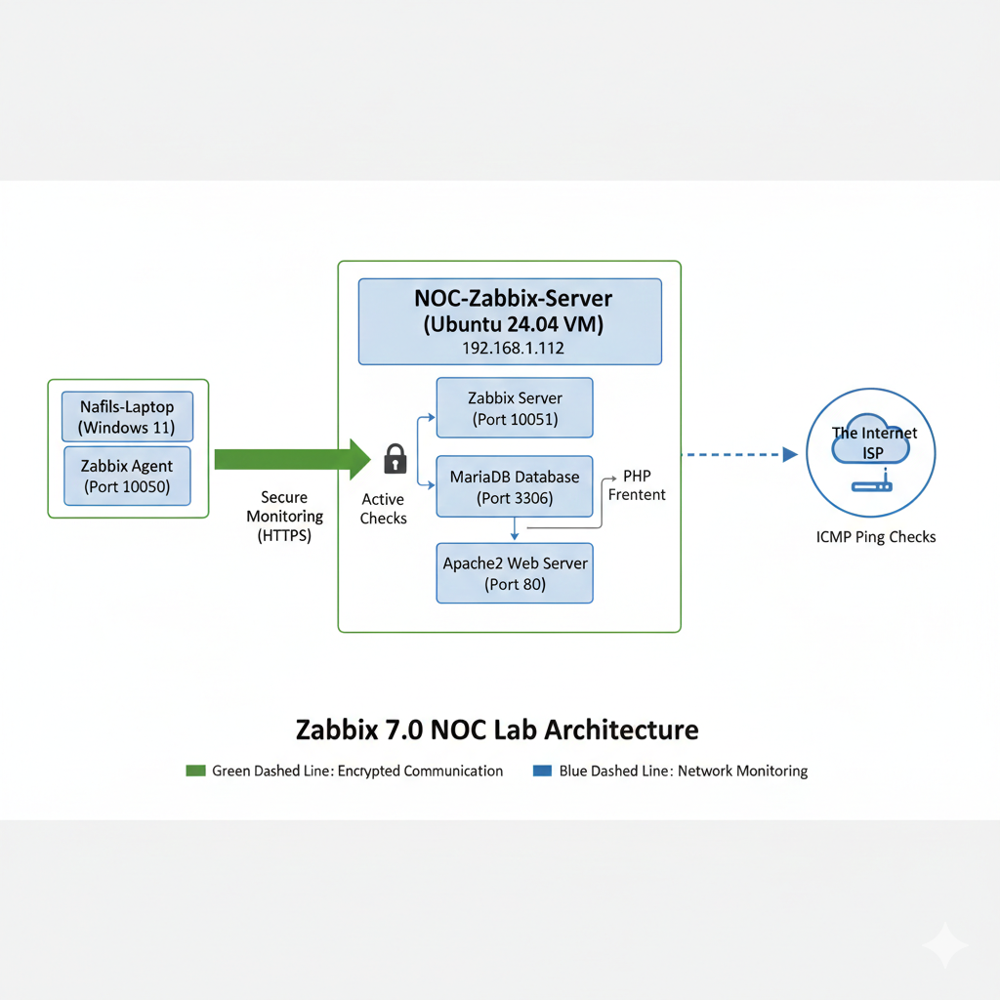

# Zabbix-Monitoring-Lab-Deployment-Configuration
# Enterprise Monitoring Lab: Zabbix 7.0 on Ubuntu 24.04

## 🌐 Project Overview
This project demonstrates the end-to-end deployment of a **Zabbix 7.0** monitoring solution. The lab was built to simulate a Network Operations Center (NOC) environment, providing real-time visibility into server health, database performance, and network availability.

## 🗺️ System Architecture


The architecture consists of a Linux-based monitoring core (Ubuntu 24.04) running a MariaDB backend and an Apache2 web frontend, designed to collect data from remote and local hosts.

## 🛠️ Tech Stack
* **OS:** Ubuntu 24.04 LTS (Virtualized via VirtualBox)
* **Monitoring:** Zabbix 7.0 (LTS)
* **Database:** MariaDB 10.11
* **Web Server:** Apache2
* **Language:** PHP 8.3

## 🚀 Deployment Steps

### 1. Repository Configuration
Added official Zabbix 7.0 release repositories to ensure access to the latest LTS features.
```bash
wget [https://repo.zabbix.com/zabbix/7.0/ubuntu/pool/main/z/zabbix-release/zabbix-release_7.0-2+ubuntu24.04_all.deb](https://repo.zabbix.com/zabbix/7.0/ubuntu/pool/main/z/zabbix-release/zabbix-release_7.0-2+ubuntu24.04_all.deb)
sudo dpkg -i zabbix-release_7.0-2+ubuntu24.04_all.deb
sudo apt update
2. Database Initialization
Configured MariaDB and created the primary schema for data retention.

SQL
CREATE DATABASE zabbix CHARACTER SET utf8mb4 COLLATE utf8mb4_bin;
CREATE USER 'zabbix'@'localhost' IDENTIFIED BY 'your_password';
GRANT ALL PRIVILEGES ON zabbix.* TO 'zabbix'@'localhost';
3. Schema Import
Imported the initial server schema. This step verifies the connection between the Linux filesystem and the SQL backend.

Bash
sudo zcat /usr/share/zabbix-sql-scripts/mysql/server.sql.gz | mysql --default-character-set=utf8mb4 -uzabbix -p zabbix
🔧 Troubleshooting: The "Schema Conflict" Fix
During the deployment, I encountered a critical SQL error:

ERROR 1050 (42S01): Table 'role' already exists

Resolution:
Identified that the schema import had partially completed or overlapped. I performed a "Clean State" reset by dropping the existing database and recreating the environment to ensure zero data corruption.

SQL
DROP DATABASE zabbix;
CREATE DATABASE zabbix CHARACTER SET utf8mb4 COLLATE utf8mb4_bin;
-- Re-ran zcat import successfully.
✅ Final Verification
Successfully passed all Web Frontend prerequisite checks, confirming optimal PHP configurations for:

Memory Limit & Execution Time

Database Extension Support

Timezone Synchronization (Asia/Kolkata)

📊 Results
The Zabbix Dashboard is fully operational, monitoring the local server's CPU, RAM, and internal services, providing a "single pane of glass" view for infrastructure health.
